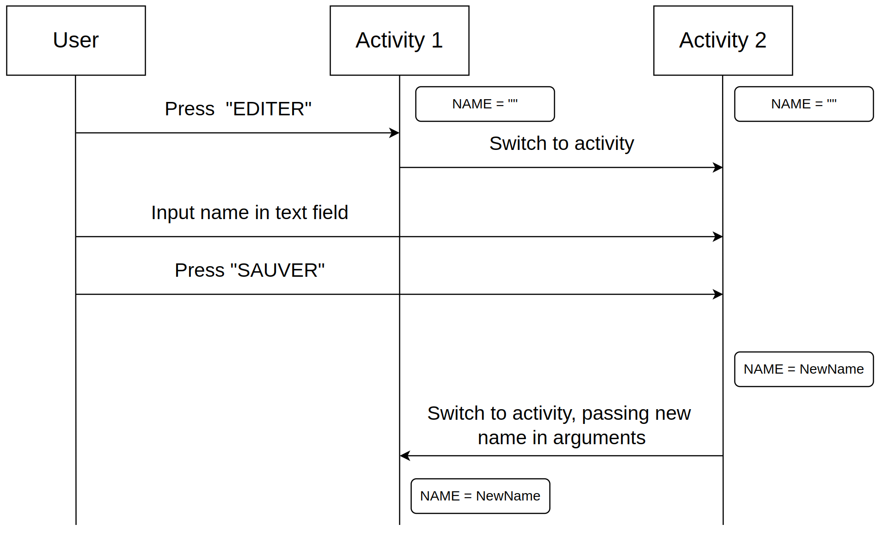
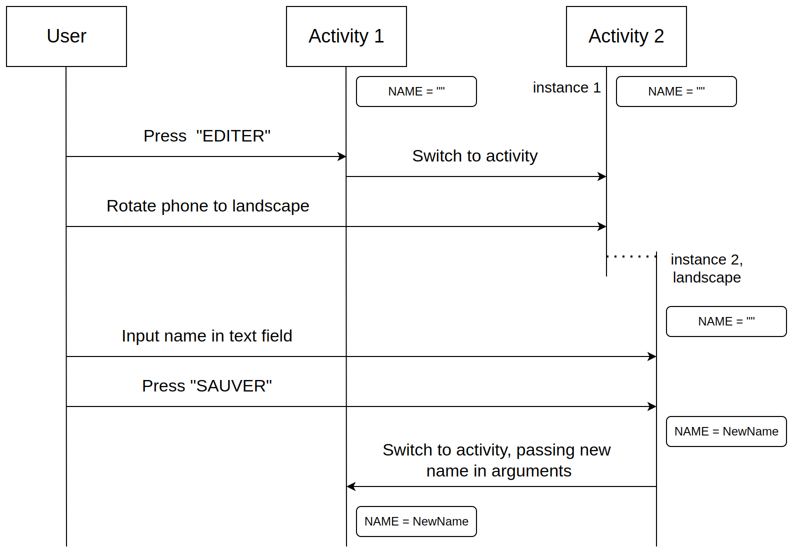

# DAA - Laboratoire 2 : Les briques logicielles de base, *Les Activités* et *les Fragments*

Auteurs :

- Ian Escher :smiley:
- Thomas Germano :cat:

## 1\. Les Activités

>  Que se passe-t-il si l’utilisateur appuie sur « back » lorsqu’il se trouve sur la seconde Activité ?

On retourne à la première activité. Les données non enregistrées concernant la deuxième activité seront irrémédiablement perdues, et son état ne pourra pas être restauré.

> Veuillez réaliser un diagramme des changements d’état des deux Activités pour les utilisations suivantes, vous mettrez en évidence les différentes instances de chaque Activité :

> L’utilisateur ouvre l’application, clique sur le bouton éditer, renseigne son prénom et sauve.

> L’utilisateur ouvre l’application en mode portrait, clique sur le bouton éditer, bascule en mode paysage, renseigne son prénom et sauve.

> Que faut-il mettre en place pour que vos Activités supportent la rotation de l’écran ? Est-ce nécessaire de le réaliser pour les deux Activités, quelle est la différence ?

La rotation de l'écran est prise en charge par les deux activités, et il n'a pas été nécessaire de mettre en place des configurations particulières.

## 2\. Les Fragments, premiers pas

> Les deux Fragments fournis implémentent la restauration de leur état. Si on enlève la sauvegarde de l’état sur le ColorFragment sa couleur sera tout de même restaurée, comment pouvons-nous expliquer cela ?

Premièrement, il faut savoir que Kotlin propose une sauvegarde automatique, pour certains paramètres mais pas tous, avec les fonctions onSaveInstanceState pour la sauvegarde et onRestoreInstanceState pour la restauration.

Malheureusement, pour la première activité, il ne sauvegarde pas le nom, la tâche nous incombe donc. Pour cela il suffit d'ovveride les fonctions et de sauvegarder et de restaurer ce que l'on souhaite.

Pour la deuxième, tout est déjà géré !

> Si nous plaçons deux fois le CounterFragment dans l’Activité, nous aurons deux instances indépendantes de celui-ci. Comment est-ce que la restauration de l’état se passe en cas de rotation de l’écran ?

Le système gère les deux instances de manière distincte, chacune ayant ses propres variables indépendantes. La restauration se déroule conformément aux attentes, en prenant en compte leur propre contexte respectif.

## 3\. Le FragmentManager

> A l’initialisation de l’Activité, comment peut-on faire en sorte que la première étape s’affiche automatiquement ?

Dans la méthode `onCreate` de l'activité principale, nous vérifions si le `savedInstanceState` est nul, ce qui signifie que l'activité n'a pas encore été créée. Si tel est le cas, nous procédons à la création de la première instance de ce fragment.

> Comment pouvez-vous faire en sorte que votre implémentation supporte la rotation de l’écran ? Nous nous intéressons en particulier au maintien de l’état de la pile de Fragments et de l’étape en cours lors de la rotation.

Lors de la rotation de l'écran, la pile de Fragments est recréée à l'identique par le FragmentManager. En ce qui concerne l'état interne, il n'est généralement pas nécessaire de le sauvegarder, car le Fragment gère la restauration de son propre état en demandant au FragmentManager de l'activité parente la taille actuelle de la pile. Cependant, si vous avez besoin de sauvegarder des variables, vous pouvez les ajouter en utilisant la méthode `Bundle.putInt(VAR_NAME, val)`. Vous pouvez le faire lors de la définition des arguments de votre fonction `newInstance` ou à d'autres endroits appropriés pour assurer une restauration correcte de l'état du fragment après une rotation de l'écran.

> Dans une transaction sur le Fragment, quelle est la différence entre les méthodes add et
replace ?

La fonction "Replace" suspend brièvement le fragment actuel, le retire de la vue, puis le remplace par un nouveau fragment. En conséquence, les méthodes OnResume et onCreate du fragment précédent sont appelés. "Add" superpose les fragments sans mettre en pause ni cacher la vue de l'un d'entre eux.